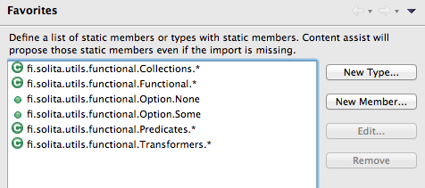

# A more-or-less functional util library for general use. Now with added code generation.

Code generation is highly recommended since it provides kind of poor-mans-first-class-functions in regular java code, thus greatly lessening the pain of using functional constructs. See examples (todo) for more info.

## Installing

> git clone git://github.com/solita/functional-utils.git

and use as a regular java project. Eclipse project/classpath files are included.

...or include as a jar file in the classpath. Bundled pom.xml can be used to package the jar, or just use [the latest ready-made file](functional-utils.jar)

You might also want to use *Eclipse favorites* (any similar thing in Idea?) so that you never have to write a single import clause.
Add the following types/functions to *Eclipse Preferences -> Java -> Editor -> Content Assist -> Favorites*:

## Examples

### fi.solita.utils.functional.Collections

	List<Integer> emptyList = newList();
	Set<String> emptySet = newSet();
	Map<Long, Integer> emptyMap = newMap();

	int[] primitiveArray = new int[]{1, 2, 3};
	List<Integer> listFromPrimitives = newList(primitiveArray);
	Set<Integer> setFromPrimitives = newSet(primitiveArray);

	Iterable<Integer> iterable = newList(1, 2, 3);
	List<Integer> listFromIterable = newList(iterable);
	Set<Integer> setFromIterable = newSet(iterable);

	List<? extends Map.Entry<String, Integer>> entries = newList(Pair.of("foo", 1), Pair.of("bar", 2));
	Map<String, Integer> mapFromIterableEntries = newMap(entries);
	Map<String, Integer> mapFromEntries = newMap(Pair.of("foo", 1), Pair.of("bar", 2));

	Character[] arrayFromPrimitives = newArray('a', 'b', 'c');
	char[] primitiveArrayFromObjectArray = newArray(arrayFromPrimitives);
	Character[] objectArrayFromPrimitiveArray = newArray(primitiveArrayFromObjectArray);

	Iterable<Character> charSequenceToIterable = it("foo");

### fi.solita.utils.functional.Option

	Option<String> optionContainingFoo = Some("foo");
	Option<String> emptyOption = None();

	Option<String> valueResultsInSome = Option.of("foo");
	Option<Object> nullResultsInNone = Option.of(null);

	String string = optionContainingFoo.get();
	try { 
	    emptyOption.get();
	} catch (UnsupportedOperationException e) {}

	String foo = optionContainingFoo.getOrElse("bar");
	String bar = emptyOption.getOrElse("bar");

	boolean someIsDefined = Some("foo").isDefined();
	boolean noneIsNotDefined = None().isDefined();

	for (String str: optionContainingFoo) {
	    // executed once
	}

	for (String str: emptyOption) {
	    // never executed
	}

## Code generation

### Eclipse

Create (or open an existing) Java project.

Add functional-utils as a project dependency (as a jar file or a project):

Project properties -> Java Compiler -> Annotation Processing:
<ul>
  <li>Enable project specific settings</li>
	<li>Enable annotation processing</li>
</ul>

Project properties -> Java Compiler -> Annotation Processing -> Factory Path:
<ul>
	<li>Enable project specific settings</li>
	<li>Add JARs... and select functiona-utils.jar</li>
</ul>

Now whenever you save a file the metadata classes are automatically generated and immediately ready for use.

### IntelliJ Idea

TODO: Anyone know how Idea supports Annotation Processors?

### Maven/Gradle/...

Please consult the documentation of your build tool on how to enable and control annotation processing.

## Word of warning

This package comes with no warranty what-so-ever. It's higly experimental, might contain loads of bugs and needs more testing.
Packages and classes may get renamed or moved, and things may suddenly break.
Use at your own risk!

Bug reports, feature requests and opinionated recommendations are highly welcome ;)

## License

Copyright © Solita Oy

Distributed under the MIT License.
